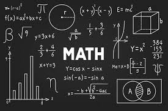

# Mathematics Assignment 2

## Syllabus

- Unit 2: __Partial differentiation__
  -  
  -  
  -  
  - 

| Content Table |
|:-------:|
| [Question 1](#question-1) |
| [Question 2](#question-2) |
| [Question 3](#question-3) |
| [Question 4](#question-4) |
| [Question 5](#question-5) |
| [Question 6](#question-6) |
| [Question 7](#question-7) |
| [Question 8](#question-8) |
| [Question 9](#question-9) |
| [Question 10](#question-10) |
| [Question 11](#question-11) |
| [Question 12](#question-12) |
| [Question 13](#question-13) |
| [Question 14](#question-14) |
| [Question 15](#question-15) |
| [Question 16](#question-16) |
| [Question 17](#question-17) |
| [Question 18](#question-18) |
| [Question 19](#question-19) |
| [Question 20](#question-20) |
| [Question 21](#question-21) |
| [Question 22](#question-22) |
| [Question 23](#question-23) |
| [Question 24](#question-24) |
| [Question 25](#question-25) |
| [Question 26](#question-26) |
| [Question 27](#question-27) |
| [Question 28](#question-28) |
| [Question 29](#question-29) |
| [Question 30](#question-30) |
| [Question 31](#question-31) |
| [Question 32](#question-32) |
| [Question 33](#question-33) |
| [Question 34](#question-34) |

### Question 1: 

Evaluate the following limits: 

(i) $$\lim_{({x\rightarrow 0},{y\rightarrow 0})} \frac{x^2}{x^4+y^2}$$

(ii)
$$\lim_{({x\rightarrow 0},
{y\rightarrow 0})} \frac{xy}{y^2-x^2}$$

(iii)
$$\lim_{({x\rightarrow \infty},
{y\rightarrow 3})} \frac {2xy-3}{x^3+4y^3}$$

(iv)
$$\lim_{({x\rightarrow 1},
{y\rightarrow 1})} \frac{x(y-1)}{y(x-1)}$$

### Question 2: 

Show that: 
$$\lim_{x\rightarrow o}[\lim_{y\rightarrow 0} f(x,y)] \neq \lim_{y\rightarrow 0}[\lim_{x\rightarrow0} f(x,y)]$$

where:
 $$ f(x,y) = \frac{x-y}{x+y}$$

### Question 3: 

Examine the continuity at origin of the given functions:

(i)
$$ f(x,y) =\begin{cases}
\frac{x^2}{\sqrt{x^2 + y^2}} &\text for: x\neq 0 , y\neq 0 \\ 3 &\text for: x=0,y=0 \end{cases}$$ 

(ii)
$$ f(x,y) =\begin{cases} \frac{x}{1+\sqrt {x^2+y^2}} &\text for: x\neq 0, y\neq 0 \\ 0 &\text for: x=0,y=0 \end{cases}$$

### Question 4: 

Is the given function $$ f(x,y)= \begin{cases} \frac {xy(x^2-y^2)}{x^2+y^2} &\text for: (x,y) \neq (0,0) \\ 4 &\text for: (x,y)=(0,0)\end{cases}$$

continuous at (0,0). Redefine, if necessary to make it continuous at (0,0).

### Question 5: 
Find the first order derivatives of the following function: 

(i) $$u=e^x\sin{y}$$

(ii) $$u=x^{xy}$$

(iii) $$f(x,y,z)=z\sin^{-1}{(\frac{y}{x})}$$

(iv) $$f(u,v,w)=\frac{(u^2-v^2)}{(v^2+w^2)}$$

### Question 6: 

If  $$w=\ln(y\sin{x}+x\sin{y})$$ , show that: $$w_{xy}=w_{yx}$$

### Question 7: 

If $$w=r^m$$ prove that $$w_{xx}+w_{yy}+w_{zz}= m(m+1)r^{m-2}$$ where $$r=\sqrt{x^2+y^2+z^2}$$

### Question 8: 

If $$u=r^n(3\cos^2\theta -1)$$
Find the value of __n__ if _u_ dsatisfies the following equation:

$$\frac{\partial}{\partial r}(r^2\frac{\partial u}{\partial r})+\frac{1}{\sin \theta} \frac{\partial}{\partial \theta}(\sin \theta\frac{\partial u}{\partial \theta})=0$$

### Question 9: 

If $$f(x,t)=a(\sin{bx})(\cos{t})$$ show that: 

$$\frac{\partial^2{f}}{\partial x^2}=b^2 \frac{\partial^2f}{\partial t^2}$$

### Question 10: 

If $$u=\ln(x^3+y^3+z^3-3xyz)$$ show that: 

$$(\frac{\partial}{\partial x}+\frac{\partial}{\partial y}+\frac{\partial}{\partial z})^2 u = \frac{-9}{(x+y+z)^2}$$

### Question 11: 

If $$z=x^2-y^2; x=r\cos \theta, y=r\sin \theta$$

Find:

(i) $$(\frac{\partial z}{\partial r})_ \theta$$

(ii) $$(\frac{\partial z}{\partial r})_ u$$

(iii) $$(\frac{\partial z}{\partial r})_y$$

### Question 12: 

If $$E= f(P,T)$$ and $$T=g(P,v)$$

show that:

$$(\frac{\partial E}{\partial P})_v=f_P+f_Tg_P$$

$$=(\frac{\partial E}{\partial P})_T +(\frac{\partial E}{\partial T})_P(\frac{\partial T}{\partial P})_v$$

### Question 13:

If $$f(P,v,t)=0$$ show that: 

$$(\frac{\partial P}{\partial T})=-(\frac{\partial v}{\partial T})_P(\frac{\partial P}{\partial v})_T$$

### Question 14: 

If  $$u=\tan^{-1}(\frac{y}{x})$$  and $$y=x^4$$ . 

Find $$\frac{du}{dx}$$ at $$x=1$$

### Question 15: 

If $$u=x^3ye^z$$ where $$x=t$$ ; $$y=t^2$$ ; $$z=\ln t$$

Find $$\frac{du}{dt}$$ at $$t=2$$ .

### Question 16: 

If  $$u=\tan{(x^2+y^2)}$$ and $$x^2-y^2=2$$ .

Find $$\frac{du}{dx}$$

### Question 17: 

If  $$u=(x,y,z)=e^{xyz}$$ . Find differential of u.

### Question 18: 

If  $$u=x^y$$ ; $$x=\sin{(t)}$$ ; $$y=\tan^{-1}{(t)}$$ 

Find $$\frac{du}{dt}$$.

### Question 19: 

If $$V=f(\frac{x}{y} , \frac{y}{z} , \frac{z}{x})$$

show that: 

$$x\frac{\partial V}{\partial x} + y\frac{\partial V}{\partial y} + z\frac{\partial V}{\partial z} = 0$$

### Question 20: 

Transform the Laplacian 
$$\frac{\partial^2 V}{\partial u^2} + \frac{\partial^2 V}{\partial v^2}$$
by changing the variables from u,v to x,y where: 

$$x=u\cos \theta - v\sin \theta$$ 

$$y=u\sin \theta + v\sin \theta$$

### Question 21: 
`controversial`

If 
$$V=(1-2xy+y^2)^{\frac{-1}{2}}$$

prove that: 

$$x\frac{\partial V}{\partial x} - y\frac{\partial V}{\partial y} = y^2V^3$$

### Question 22: 

If 
$$u=x^2+2xy-y\log{z}$$ and $$x=s+t^2,y=s-t^2,z=2t$$ . Find $$\frac{\partial u}{\partial s}$$ and $$\frac{\partial u}{\partial t}$$ at(1,2,1).

### Question 23: 

If 
$$(\cos{x})^y=(\sin{y})^x$$
Find
$$\frac{dy}{dx}$$ .

### Question 25: 

If 
$$ye^{xy}=\sin{x}$$
Find 
$$\frac{dy}{dx}$$
and 
$$\frac{d^2y}{dx^2}$$
at (0,0).

### Question 26: 

If 
$$u=\sin^{-1}(\frac{x^2y^2}{x+y})$$
show that
$$xu_x + yu_y = 3\tan{u}$$

### Question 27: 

If 
$$\tan{u}=\frac{x^3+y^3}{x-y}$$
show that 
$$x^2 u_{xx} + 2xy u_{xy} + y^2 u_{yy} = 2\cos{3u}\sin{u}$$

### Question 28: 
Verify Euler's Theorem for:

$$f=\frac{z}{x+y}+\frac{y}{z+x}+\frac{x}{y+z}$$

### Question 29: 

If 
$$(\sqrt{x}+\sqrt{y})\cot{f}-x-y=0$$

Prove that:

$$4xf_x+4yf_y+\sin{2f}=0$$

### Question 30: 

If
$$f=\ln\frac{(x^4+y^4)}{(x+y)}$$
show that:
$$xf_x+yf_y=3$$

### Question 31:

Find the Jacobian
$$J=\frac{\partial(u,v)}{\partial(x,y)}$$
when:

(i) 
$$u=3x+5y, v=4x-3y$$

(ii)
$$x=u(1-v),y=uv$$ 
also show that 
$$JJ'=1$$

### Question 32: 

If 
$$u=xyz, v=xy+yz+zx,w=x+y+z$$
Find
$$\frac{\partial(u,v,w)}{\partial(x,y,z)}$$

### Question 33:

If
$$X=u^2v,Y=uv^2,u=x^2-y^2,v=xy$$
Find
$$\frac{\partial(X,Y)}{\partial(x,y)}$$

### Question 34:

Find 
$$\frac{\partial(u,v)}{\partial(r,\theta)}$$
,if
$$u=2xy,v=x^2-y^2$$
and 
$$x=r\cos \theta,y=r\sin \theta$$

### Other Assignments:

|[Assignment 1](https://saksham3736.github.io/mathematics/)|
|:---------------------------------------------------------:|
|[Assignment 3](https://saksham3736.github.io/mathematics2/)|

#### Made by:
- Name: Saksham
- Branch: Computer Science Engineering
- My portfolio: [Saksham](https://saksham3736.github.io)
